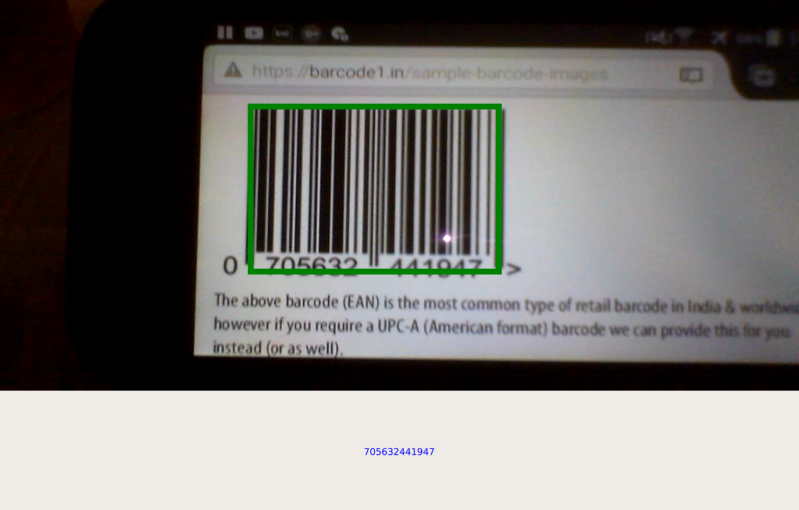

[TOC]

Milo Code DB main ([online](https://docs.milosolutions.com/milo-code-db/main/) | [offline](\ref milodatabasemain))

[Source code](https://github.com/milosolutions/mbarcodescanner)



# Getting Started

MBarcodeScanner is used for scanning barcodes and QR codes. It's based on [QZXing](https://github.com/ftylitak/qzxing) library. It works cross-platform on
all OSes supported by Qt.

Supports barcode decoding for the following types: 

 * UPC-A 	
 * UPC-E 	
 * EAN-8 	
 * EAN-13 	
 * ITF 	
 * Code 39 
 * Code 93 	
 * Code 128 	
 * Codabar 	
 * QR Code
 * Data Matrix
 * Aztec (beta)
 * PDF 417 (beta)

# How to use

MBarcodeScanner may be used in one of two configurations:

1. **Just barcode scanning** - in this configuration you are able to scan barcodes from camera output. 
2. **Barcode scanning with region detection** - in this configuration you are able to scan barcodes from camera output and also see barcode region on screen.

## Barcode scanning

To use just barcode scanning (**configuration 1**) you should do following:
1. Build QZXing library on target platform (see \ref how_to_build ([online version](https://docs.milosolutions.com/milo-code-db/mbarcodescanner/how_to_build.html))). Also you can use prebuilt [QZXing](https://seafile.milosolutions.com/d/248e22bd10/) library and headers.
2. Specify paths to headers and libraries in *.pro file.
```
	INCLUDEPATH += # path to qzxing headers
	LIBS += # path to qzxing library
	ANDROID_EXTRA_LIBS = # path to qzxing library (with file name)
```
3. Compile and enjoy.

## Barcode scanning with region detection

To use barcode scanning with region detection (**configuration 2**) you should do following:
1. Apply qzxing.patch and build QZXing library on target platform (see \ref how_to_build). Also you can use prebuilt [QZXing_patched](https://seafile.milosolutions.com/d/e53be4943e/) libraries and headers.
2. Activate **draw_region** configuration (uncomment #CONFIG += draw_region).
3. Specify paths to headers and libraries in *.pro file.
```
	INCLUDEPATH += # path to qzxing headers
	LIBS += # path to qzxing library
	ANDROID_EXTRA_LIBS = # path to qzxing library (with file name)
```
4. Compile and enjoy.

You can find some tricks with camera (see \ref camera_tricks ([online version](https://docs.milosolutions.com/milo-code-db/mbarcodescanner/camera_tricks.html))).

For example usage, see main.cpp file. This project is fully docummented - please check doxygen docs or see the comments directly in the source file(s).

# License

This project is licensed under the MIT License - see the LICENSE-MiloCodeDB.txt file for details

# Gallery

Here are some examples showing barcode scanner:


Basic barcode detection


Basic QR code detection


Barcode detection, with region detection
